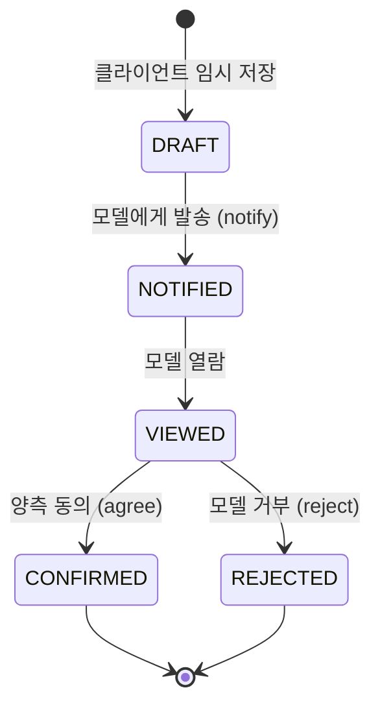
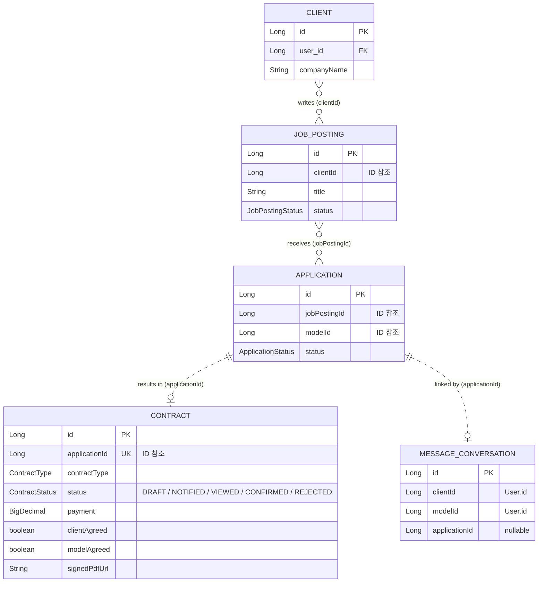
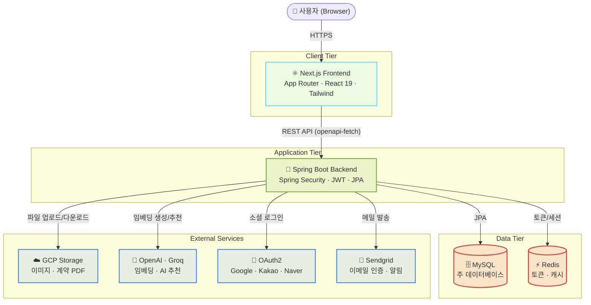

<div align="center">

# 

**MODLE · 계약 도메인 개발기 — 임현호**

모델–클라이언트 매칭 플랫폼 **MODLE**에서 제가 맡은 **계약(Contract) 도메인**을 중심으로,
설계 판단과 성능 트러블슈팅을 정리한 개인 포트폴리오 저장소입니다.

[🔗 서비스 바로가기](https://modle-eta.vercel.app) · [📹 데모 영상](https://drive.google.com/file/d/1_EtW_RT1hyAE6_fkIGSAZIzuWU0LkFiw/view?usp=sharing) · [🧾 원본 팀 저장소](https://github.com/prgrms-aibe-devcourse/AIBE6_Project2_Team01)

</div>

---

## 📑 목차

1. [이 저장소에 대하여](#-이-저장소에-대하여)
2. [프로젝트 한눈에](#-프로젝트-한눈에)
3. [내가 맡은 일 — 계약 도메인](#-내가-맡은-일--계약-도메인)
4. [트러블슈팅 · 3N+2 쿼리를 5개로](#-트러블슈팅--3n2-쿼리를-5개로)
5. [기술적 의사결정 기록](#-기술적-의사결정-기록)
6. [기술 스택](#-기술-스택)
7. [데이터 모델](#-데이터-모델)
8. [시스템 아키텍처](#-시스템-아키텍처)
9. [실행 방법](#-실행-방법)
10. [팀 & 원본 프로젝트](#-팀--원본-프로젝트)

---

## 🙋 이 저장소에 대하여

- 이 저장소는 5인 팀 프로젝트 **Modle**의 **개인 포크**입니다. 원본은 [prgrms-aibe-devcourse/AIBE6_Project2_Team01](https://github.com/prgrms-aibe-devcourse/AIBE6_Project2_Team01)이며, 전체 서비스는 팀원 5명이 함께 만들었습니다.
- 이 README는 **제가 담당한 계약(Contract) 도메인**을 중심으로, 기능·설계 판단·성능 개선 과정을 포트폴리오 관점에서 다시 정리한 문서입니다.
- 전체 팀 관점의 원본 README는 [`README.team-original.md`](README.team-original.md)에 그대로 보존해 두었습니다.


---

## 📌 프로젝트 한눈에

**Modle**은 광고·화보·행사 촬영에 필요한 **모델**과 이를 찾는 **클라이언트**를 AI 추천 기반으로 연결하고, 지원·계약·리뷰까지 한 곳에서 처리하는 매칭 서비스입니다.

매칭이 성사되면 쪽지로 소통하고 **전자 계약서(PDF)** 를 작성·서명한 뒤 촬영을 진행하고 상호 리뷰를 남깁니다. 제가 담당한 계약 도메인은 이 흐름에서 **"컨택 이후 ~ 촬영 확정"** 사이를 책임집니다.

| 항목 | 내용 |
|------|------|
| 프로젝트명 | Modle |
| 팀 | AIBE6 Project2 Team01 (락(樂)&롤(Role)) |
| 개발 기간 | 2026.06.11 ~ 2026.06.24 |
| 나의 담당 | **계약 도메인**, 계약–쪽지 연동 API |
| 한 줄 소개 | 모델이 필요한, 모델이 되고 싶은 분들을 위한 매칭 플랫폼 |

---

## 🧑‍💻 내가 맡은 일 — 계약 도메인

매칭이 성사된 지원 건을 실제 계약으로 확정하는 **전자 계약(Contract)** 전 과정을 설계·구현했습니다.

### 담당 범위
- **전자 계약서 작성/저장** — 촬영 일정·장소·페이·사용 범위 등을 담은 계약서 임시 저장(DRAFT)과 템플릿(`ContractTemplate`) 기반 작성
- **계약서 PDF 생성** — `OpenHTMLtoPDF`로 HTML 템플릿을 PDF로 변환, 양 당사자 동의/서명과 **IP·시각 기록**
- **계약 상태 흐름 관리** — `DRAFT → NOTIFIED → VIEWED → CONFIRMED / REJECTED`, 양측 동의 시 자동 확정
- **계약–쪽지 연동 API** — 계약 발송·진행 상태를 쪽지(대화) 흐름과 이어 붙여, 지원(`applicationId`)을 매개로 대화방과 계약을 연결

### 계약 상태 흐름



### API 요약 — `/api/v1/contracts`

| Method | Endpoint | 설명 |
|--------|----------|------|
| `POST` | `/` | 계약서 임시 저장 (DRAFT 생성) |
| `GET` | `/` | 상태별 계약 내역 조회 (CLIENT·MODEL) |
| `GET` | `/templates` | 계약서 템플릿 목록 조회 (CLIENT) |
| `POST` | `/pdf` | 계약서 PDF 생성 (CLIENT) |
| `POST` | `/{id}/notify` | 계약서 모델에게 발송 (CLIENT) |
| `GET` | `/{id}` | 계약서 열람 (MODEL) |
| `PATCH` | `/{id}/agree` | 계약서 동의 (양측 동의 시 자동 확정) |
| `PATCH` | `/{id}/reject` | 계약서 거부 (MODEL) |

> 전체 API는 백엔드 실행 후 [Swagger UI](http://localhost:8080/swagger-ui/index.html)에서 확인할 수 있습니다.

---

## 🔧 트러블슈팅 · 3N+2 쿼리를 5개로

> 모델 마이페이지의 "계약 내역" 탭이 계약이 쌓일수록 느려졌습니다. **같은 API인데 기업 계정으로 보면 멀쩡**했던 게 실마리였습니다.

<table>
<tr><th>구분</th><th>변경 전</th><th>변경 후</th></tr>
<tr><td>공고(<code>job_posting</code>)</td><td><code>id=?</code> 개별 N번</td><td><code>id in (…)</code> <b>1번</b></td></tr>
<tr><td>기업(<code>client</code>)</td><td><code>user_id=?</code> 개별 N번</td><td><code>id in (…)</code> <b>1번</b></td></tr>
<tr><td>유저</td><td>N번 (낭비)</td><td><b>제거</b></td></tr>
<tr><td><b>합계</b></td><td><b>3N + 2</b></td><td><b>약 5개 상수</b></td></tr>
</table>

- **원인** — 목록을 순회하며 계약 1건마다 공고·유저·기업을 개별 조회. 그중 유저 조회는 넣은 값을 그대로 돌려받는 **낭비 쿼리**였습니다.
- **해결** — id를 모아 `IN` 배치 조회 후 `Map`으로 매칭. 낭비 쿼리는 제거. 바로 옆 `getClientContracts`가 이미 쓰던 패턴을 모델 경로에도 이식했습니다.
- **검증** — 리팩터링 전/후를 각각 띄워 같은 필터를 눌러 SQL 로그를 세어봤고, 변경 전 **공고 6번·기업 6번**이 계약 건수에 정확히 비례(3N+2)함을 확인, 변경 후엔 각각 `IN` 한 방으로 접혔습니다.

📖 **자세한 과정 →** [계약이 쌓일수록 느려지는 목록 화면, 3N+2 쿼리를 5개로 줄인 트러블슈팅](https://velog.io/@predev/%EB%B6%80%ED%8A%B8%EC%BA%A0%ED%94%84-2%EC%B0%A8%ED%94%84%EB%A1%9C%EC%A0%9D%ED%8A%B8-%ED%8A%B8%EB%9F%AC%EB%B8%94%EC%8A%88%ED%8C%85N1)

---

## 🧭 기술적 의사결정 기록

계약 도메인을 만들며 내린 판단들을, "왜 그렇게 했는가"와 함께 남깁니다.

<details open>
<summary><b>① 왜 <code>@EntityGraph</code>·fetch join이 아니라 배치 + Map인가</b></summary>

<br>

우리 프로젝트는 도메인 결합을 끊기 위해 엔티티를 `@ManyToOne`으로 엮지 않고 **`Long` id 값으로만 참조**합니다(`Application`은 `Long jobPostingId`). `@EntityGraph`·`@BatchSize`·fetch join은 전부 **JPA 연관관계 위에서만 동작**하는데, 우리에겐 숫자 컬럼뿐이라 묶어서 당겨올 연관 자체가 없습니다. 게다가 이번 N+1은 lazy 로딩이 아니라 **루프 안에서 `service.findById()`를 직접 반복 호출**해 난 것이라, 그 어노테이션이 손댈 종류도 아니었습니다. **id 참조 설계에서는 배치 + Map이 대체재가 아니라 정공법**입니다.

</details>

<details>
<summary><b>② 목록 조회에서 예외 대신 <code>null</code>을 택한 이유</b></summary>

<br>

배치로 바꾸니 없는 데이터가 예외 대신 `null`이 됩니다. 단건 조회라면 예외(fail-fast)가 맞지만, **목록에서 예외를 던지면 계약 하나 때문에 화면 전체가 안 열립니다.** 공고는 하드 삭제가 가능해 "절대 없을 수 없는 상태"도 아니고, 코드베이스의 다른 배치 목록도 이미 null을 허용하고 있어 일관되게 null을 유지했습니다. **"방어적"의 방향은 맥락마다 다르다** — 단건의 fail-fast가 목록에선 화면을 통째로 깨는 fail-loud가 됩니다.

</details>

<details>
<summary><b>③ 계약–지원–쪽지를 <code>applicationId</code>로 잇는 설계</b></summary>

<br>

계약(`Contract`)은 지원(`Application`)당 하나이므로 `applicationId`를 유니크 키로 참조합니다. 쪽지 대화방(`MessageConversation`) 역시 `applicationId`(nullable)를 갖고 있어, **지원 건을 공통 매개로 계약 진행 상태와 대화 흐름을 연결**했습니다. 여기서도 도메인 간 직접 엔티티 참조 대신 id 참조 원칙을 지켰습니다.

</details>

---

## 🛠 기술 스택

### Backend


### Database & Infra


### 계약 도메인에서 특히 쓴 것
- **OpenHTMLtoPDF** (1.0.10) — 계약서 HTML 템플릿 → PDF 생성
- **Spring Cloud GCP Storage** (5.0.4) — 서명 완료 PDF 저장
- **Spring Data JPA / MySQL** — 계약·지원·기업 도메인 조회 및 배치 최적화

<details>
<summary><b>전체 상세 버전</b></summary>

| 구분 | 기술 | 버전 |
|------|------|------|
| Language | Java | 21 |
| Framework | Spring Boot | 3.5.15 |
| Build | Gradle (Kotlin DSL) | - |
| DB | MySQL | 8.x |
| Cache/Session | Redis | 7.0 |
| Auth | JWT (jjwt) | 0.12.6 |
| Storage | Spring Cloud GCP Storage | 5.0.4 |
| API Docs | springdoc-openapi | 2.8.9 |
| PDF | openhtmltopdf | 1.0.10 |
| Frontend | Next.js | 16.2.9 |
| Frontend | React | 19.2.4 |
| Styling | Tailwind CSS | 4 |

프론트엔드(Next.js/React/Tailwind)와 AI 추천(OpenAI Embeddings, Groq)은 팀원이 담당했습니다.

</details>

---

## 🗄 데이터 모델

계약 도메인이 맞닿는 부분(지원·기업·쪽지)을 발췌한 ERD입니다. **엔티티 간 관계는 FK가 아니라 `Long` id 값 참조**로 맺어져 있습니다.



> 서비스 전체 ERD는 [`README.team-original.md`](README.team-original.md#-erd)에서 볼 수 있습니다.

---

## 🏗 시스템 아키텍처



---

## 🚀 실행 방법

### 사전 요구사항
- JDK 21
- Node.js 18+ (Next.js 16)
- MySQL 8.x (`modle` 데이터베이스 생성)
- Docker (Redis 실행용) 또는 로컬 Redis

### 1. 저장소 클론
```bash
git clone https://github.com/predevho/AIBE6_Project2_Team01.git
cd AIBE6_Project2_Team01
```

### 2. Backend 실행

**(1) Redis 실행 (Docker)**
```bash
cd modle_backend
docker compose up -d
```

**(2) 환경 변수 설정** — `modle_backend/.env` 파일을 생성하고 값을 채웁니다.
```env
DB_PASSWORD=your_mysql_password
JWT_SECRET=your_jwt_secret
REDIS_HOST=localhost
REDIS_PORT=6379
SPRING_PROFILES_ACTIVE=dev

# Mail
SENDGRID_API_KEY=...
MAIL_FROM=your_mail

# GCP Storage
GCP_PROJECT_ID=your_gcp_project_id
GCS_BUCKET_NAME=your_bucket_name
GCS_CREDENTIALS_PATH=classpath:gcs-key.json

# OAuth2
GOOGLE_CLIENT_ID=...
GOOGLE_CLIENT_SECRET=...
KAKAO_CLIENT_ID=...
KAKAO_CLIENT_SECRET=...
NAVER_CLIENT_ID=...
NAVER_CLIENT_SECRET=...

# AI
GROQ_API_KEY=...
OPENAI_API_KEY=...
OPENAI_EMBEDDING_MODEL=text-embedding-3-small

# (선택) 프론트엔드 base URL
FRONTEND_BASE_URL=http://localhost:3000
```
> GCS 서비스 계정 키 파일(`gcs-key.json`)도 함께 준비해야 합니다.

**(3) 서버 실행**
```bash
./gradlew bootRun
```
- 백엔드: `http://localhost:8080` · Swagger UI: `http://localhost:8080/swagger-ui/index.html`

### 3. Frontend 실행
```bash
cd modle_frontend
npm install
npm run dev
```
- 프론트엔드: `http://localhost:3000`

---

## 👥 팀 & 원본 프로젝트

Modle은 아래 5명이 함께 개발한 팀 프로젝트이며, 이 저장소는 그중 **임현호**의 개인 포크입니다.

| **김락현(팀장)** | **김영욱** | **신재희** | **임현호** | **최정우** |
|---------|---------|---------|---------|---------|
| [@Rakhyunn](https://github.com/Rakhyunn) | [@wooki0123](https://github.com/wooki0123) | [@SHINJAEHEE-DEV](https://github.com/SHINJAEHEE-DEV) | [@predevho](https://github.com/predevho) | [@woo0218](https://github.com/woo0218) |
| 인증/인가 · 리뷰 · 지원 완료 | 공고 · 지원 보류/취소 | 프로필 · 프론트 | **계약 · 계약–쪽지 연동** | 쪽지 · AI 추천 |

- 원본 팀 저장소: [prgrms-aibe-devcourse/AIBE6_Project2_Team01](https://github.com/prgrms-aibe-devcourse/AIBE6_Project2_Team01)
- 팀 전체 관점 README: [`README.team-original.md`](README.team-original.md)

<div align="center">

**Modle** · 계약 도메인 by [@predevho](https://github.com/predevho)

</div>
