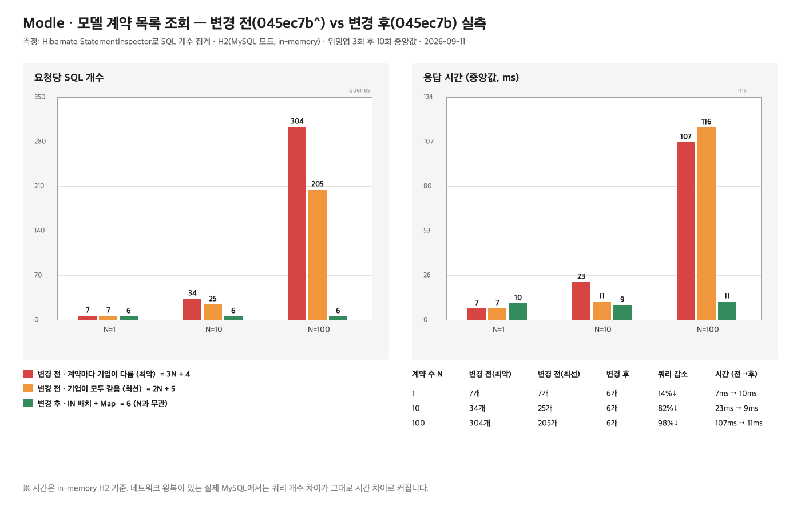

# 모델 계약 목록 조회 N+1 — 변경 전/후 실측 근거

> **확정값 (2026-09-11 실측):** 변경 전 **3N+4** (계약 100건 기준 304개) → 변경 후 **6개 고정**.
> 이전 문서·이력서에 있던 `3N+2`, `3N+3`, `5개`는 코드를 눈으로 세어 추정한 값이고, 이 폴더의 측정으로 대체한다.

측정 대상 API: `GET /api/v1/contracts` (MODEL 역할) → `ContractQueryService.getModelContracts`.

| 구분 | 커밋 | 설명 |
|---|---|---|
| 변경 전 | `3a8ce07` (`045ec7b^`) | 루프 안에서 공고·유저·기업을 건마다 개별 조회 |
| 변경 후 | `045ec7b` | 공고·기업 `IN` 배치 조회 + Map 매칭, 유저 조회 제거 |



## 결과

| 계약 수 N | 변경 전 (계약마다 기업이 다름, 최악) | 변경 전 (기업 하나, 최선) | 변경 후 |
|---|---|---|---|
| 1 | 7개 · 7ms | 7개 | **6개** · 10ms |
| 10 | 34개 · 23ms | 25개 · 11ms | **6개** · 9ms |
| 100 | **304개** · 107ms | 205개 · 116ms | **6개** · 11ms |

- **변경 전 = 3N + 4 (최악) ~ 2N + 5 (최선)**
- **변경 후 = 6 고정** (N과 무관)
- N=100 기준 쿼리 **304 → 6 (98% 감소)**, 시간 **107ms → 11ms** (in-memory H2)

같은 테스트를 여러 번 돌려도 쿼리 개수는 매번 같았다.

## 쿼리 구성 (변경 전, 최악 케이스)

| 쿼리 | 횟수 | 비고 |
|---|---|---|
| `model` (+user 조인) | 1 | `modelRepository.findByUserId` (`@EntityGraph`) |
| `client where user_id=?` | 1 | **숨은 쿼리.** `User.client`가 `@OneToOne(mappedBy)`라 LAZY가 안 걸려 유저를 불러오는 순간 따라 나감 |
| `application` | 1 | 모델의 지원 목록 |
| `contracts ... in (...)` | 1 | 이미 배치 조회였음 |
| `job_posting where id=?` | **N** | 루프 안 `jobPostingService.getJobPosting` |
| `user where id=?` | **서로 다른 기업 수** | 루프 안 `userService.findById` — 같은 기업이면 1차 캐시가 흡수 |
| `client ... where user_id=?` | **N** | 루프 안 `clientService.findByUserId` — 파생 쿼리라 1차 캐시를 타지 않아 매번 나감 |

→ 고정 4 + N + N + (기업 수) = **3N+4 (기업이 전부 다를 때) ~ 2N+5 (기업이 하나일 때)**

변경 후는 위 고정 4개 + `job_posting ... in (...)` 1개 + `client ... in (...)` 1개 = **6개**.

## 손계산이 틀렸던 이유

| 문서 | 기존 표기 | 실측 |
|---|---|---|
| README, 포트폴리오 | 3N+2 → 5개 | **3N+4 → 6개** |
| 트러블슈팅 문서 | 3N+3, 6건 기준 16~21개 → 5개 | **3N+4, 6건 기준 17~22개 → 6개** |
| 이력서 | 6건에 21개 → 5개 | **6건에 최대 22개 → 6개** |

세 계산 모두 `User.client` OneToOne이 끌고 오는 숨은 client 쿼리 1개를 빠뜨렸다. 이 쿼리는 계약 도메인이 아니라 유저 엔티티 매핑에서 오는 것이라 변경 전/후 모두 동일하게 1개씩 나가고, 그래서 고정 조회가 3이 아니라 4다.

## 측정 방법

- 테스트: [`modle_backend/src/test/java/com/modle/querycount/ContractQueryCountTest.java`](../modle_backend/src/test/java/com/modle/querycount/ContractQueryCountTest.java)
  - `@DataJpaTest`로 실제 `ContractQueryService`·`JobPostingService`·`UserService`·`ClientService` 빈을 띄우고, Hibernate `StatementInspector`(`SqlCollector`)로 실행 SQL을 한 줄씩 수집한다. 로그를 눈으로 세는 게 아니라 SQL 문자열 개수를 센다.
  - 매 호출 전 `em.clear()`로 빈 영속성 컨텍스트에서 시작 → 실제 HTTP 요청 1건과 같은 조건. (운영은 OSIV 기본값 ON이라 요청 하나가 영속성 컨텍스트 하나를 쓴다)
  - 워밍업 3회 후 10회 실행, 시간은 중앙값.
- DB는 H2 in-memory(MySQL 모드). **쿼리 개수는 Hibernate가 결정하므로 MySQL과 동일.** 시간은 네트워크 왕복이 없어 절대값이 작고, 실제 MySQL에서는 쿼리 개수 차이가 그대로 시간 차이로 커진다.

### 재현

```bash
cd modle_backend

# 변경 후 (현재 코드)
./gradlew test --tests 'com.modle.querycount.*' -Dqc.label=after
cat qc-result.txt          # 케이스별 쿼리 수·시간 요약
cat qc-sql-after.log       # 실행된 SQL 전문

# 변경 전 코드로 재기 — 3a8ce07 을 체크아웃한 뒤 querycount 테스트와 build.gradle.kts 의 h2·qc.label 설정만 얹어서 같은 명령 실행
```

## 원본 파일

- `raw/qc-result-before.txt`, `raw/qc-result-after.txt` — 케이스별 쿼리 수·시간 요약
- `raw/qc-sql-before.log`, `raw/qc-sql-after.log` — 실행된 SQL 전문 (N=100 변경 전 304줄)
- `raw/excerpt-*.txt` — 위 로그 발췌
- `raw/gradle-test-output-*.log` — Gradle 실행 출력 (BUILD SUCCESSFUL)
